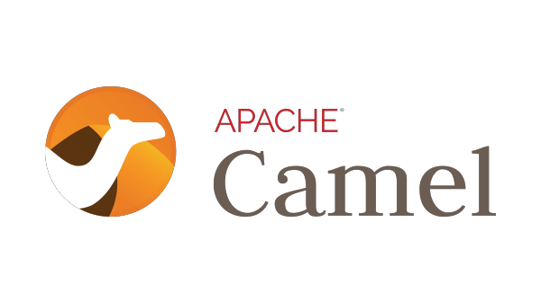

<h1 align="center">Apache-Camel</h1>

    

---

# 💻 About the project

- Apache Camel is an open source framework for message-oriented middleware with a rule-based routing and mediation engine that provides a Java object-based implementation of the Enterprise Integration Patterns using an application programming interface to configure routing and mediation rules.

---

## ⚙️ Activities

- [x] Getting Started with Apache Camel and Spring Boot.
- [x] Integrating Apache Camel with ActiveMQ and Kafka.
- [x] Exploring Apache Camel Further.
- [ ] Exploring Apache Camel Enterprise Integration Patterns.
- [ ] Exploring Apache Camel Best Practices.

---

## 🦸 Author

<a href="#">
 
 

Made by Douglas Souza 👋🏽 Get in touch!

---
## README versions

[English 🇺🇸](./README.md)